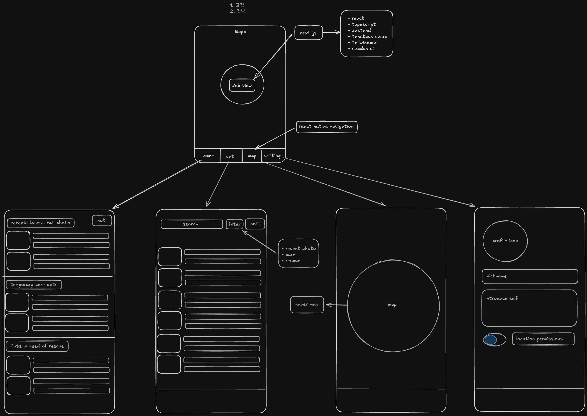

# WebView App with React Native

React Native와 Expo를 사용한 WebView 애플리케이션입니다.



## 기술 스택

- React Native
- Expo
- TypeScript
- Zustand (상태 관리)
- TanStack Query (서버 상태 관리)
- NativeWind (스타일링)
- React Native WebView

## 프로젝트 설정 과정

### 1. 프로젝트 생성

```bash
npx create-expo-app webview-app
cd webview-app
```

### 2. WebView 설정

```bash
npm install react-native-webview
```

### 3. TypeScript 설정

```bash
npm install --save-dev typescript @types/react @types/react-native @typescript-eslint/eslint-plugin @typescript-eslint/parser
```

- tsconfig.json 설정

```json
{
  "extends": "expo/tsconfig.base",
  "compilerOptions": {
    "strict": true,
    "baseUrl": ".",
    "paths": {
      "@/*": ["src/*"]
    }
  }
}
```

### 4. 스타일링 설정 (NativeWind)

```bash
npm install nativewind
npm install --save-dev tailwindcss
```

- tailwind.config.js 설정

```javascript
module.exports = {
  content: ['./App.{js,jsx,ts,tsx}', './src/**/*.{js,jsx,ts,tsx}'],
  theme: {
    extend: {}
  },
  plugins: []
}
```

- babel.config.js 설정

```javascript
module.exports = function (api) {
  api.cache(true)
  return {
    presets: ['babel-preset-expo'],
    plugins: ['nativewind/babel']
  }
}
```

## 주요 기능

1. WebView 기본 기능

   - 웹 페이지 로딩
   - 자바스크립트 활성화
   - DOM 스토리지 활성화

2. 네비게이션 컨트롤

   - 뒤로가기
   - 앞으로가기
   - 네비게이션 상태 관리

3. 사용자 경험

   - 로딩 인디케이터
   - 에러 핸들링
   - 반응형 UI

4. 상태 관리

   - Zustand를 사용한 전역 상태 관리
   - TanStack Query를 사용한 서버 상태 관리

5. 스타일링
   - NativeWind (Tailwind CSS)를 사용한 모던한 UI
   - 반응형 디자인
   - 다크/라이트 모드 지원 가능

## 문제 해결 과정

### 1. WebView 플랫폼 호환성

#### 문제

- WebView 컴포넌트가 웹 브라우저에서 지원되지 않음
- Error: "React Native WebView does not support this platform"

#### 해결

- Platform.OS를 사용하여 플랫폼별 렌더링 처리

```typescript
if (Platform.OS === 'web') {
  // 웹 브라우저에서는 직접 리다이렉트
  if (typeof window !== 'undefined') {
    window.location.href = 'http://localhost:3001'
  }
  return null
}
```

### 2. iOS SafeArea 이슈

#### 문제

- iOS에서 노치나 홈 인디케이터 영역이 WebView 컨텐츠와 겹침

#### 해결

- SafeAreaView로 WebView 컴포넌트 래핑

```typescript
import { SafeAreaView } from 'react-native-safe-area-context'

return (
  <SafeAreaView style={styles.container}>
    <WebView ... />
  </SafeAreaView>
)
```

### 3. shadcn/ui 스타일링 문제

#### 문제

- Next.js 앱에서 shadcn/ui 버튼 스타일이 적용되지 않음
- Tailwind CSS 클래스가 작동하지 않음

#### 해결

1. layout.tsx 수정

```typescript
<body className={cn('min-h-screen bg-background font-sans antialiased', inter.className)}>
  <div className='relative flex min-h-screen flex-col'>{children}</div>
</body>
```

2. tailwind.config.ts의 content 경로 수정

```typescript
content: [
  './src/**/*.{js,ts,jsx,tsx,mdx}',
  './src/app/**/*.{js,ts,jsx,tsx,mdx}',
  './src/components/**/*.{js,ts,jsx,tsx,mdx}'
],
```

## 프로젝트 구조

```
webview-app/
├── App.tsx                # 메인 앱 컴포넌트
├── src/
│   ├── store/
│   │   └── useStore.ts   # Zustand store
│   └── lib/
│       └── queryClient.ts # TanStack Query 설정
├── babel.config.js        # Babel 설정
├── tailwind.config.js     # TailwindCSS 설정
├── tsconfig.json         # TypeScript 설정
└── app.d.ts             # 타입 선언 파일
```

## 실행 방법

1. 의존성 설치

```bash
npm install
```

2. 개발 서버 실행

```bash
npm start
```

3. 실행 옵션

- iOS: `npm run ios`
- Android: `npm run android`
- Web: `npm run web`
